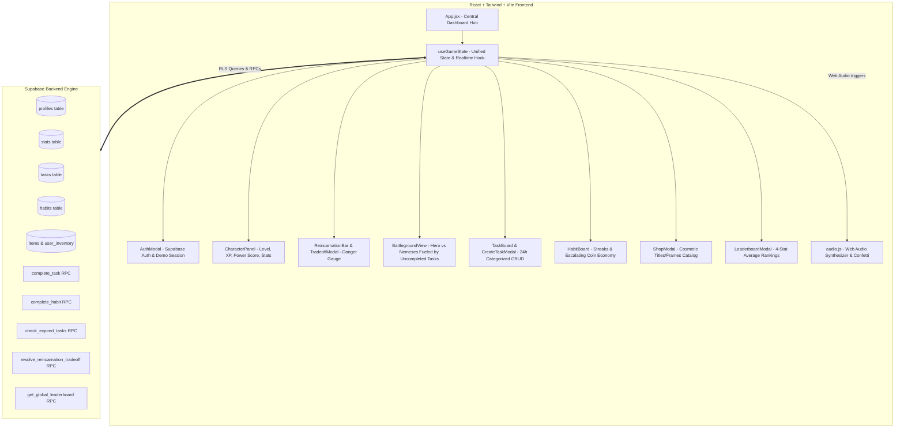

# Life RPG — Implementation Walkthrough & Master Advisories

This document provides a comprehensive technical walkthrough of how the Life RPG web application is implemented, structured, and verified, preceded by the **Master Advisories** that govern all architectural and game-design decisions.

---

## 🏛️ Master Advisories (Core Directives & System Constraints)

These master advisories derive directly from the specification in [`life-rpg-project-context.md`](./life-rpg-project-context.md) and user architecture requests:

### 1. Server-Side Authority & Anti-Cheat Rule
> [!IMPORTANT]
> **Never trust client-side arithmetic for rewards or penalties.**
> All XP gains, stat increments, leveling-up loops, streak increments, coin additions, and reincarnation penalties are calculated and verified via PostgreSQL stored procedures (RPCs) in Supabase. The client may optimistically reflect updates, but the server is the single source of truth.

### 2. The Dynamic Battleground & Enemy Threat Directive
> [!NOTE]
> **The Arena is replaced by the interactive Battleground.**
> The enemies (*Chronos of Procrastination*, *The Sloth Behemoth*, *Chaos Chimera*, and *Phantom of Hesitation*) are retained and directly bound to their respective category stats. 
> - **Visual Threat Mechanic**: Every enemy is **powered by uncompleted tasks** in its category. Pending and overdue quests fuel the enemy's dark chaos aura, threat level, and size.
> - Completing a task strikes and subdues the enemy, reducing its threat to zero when the category is cleared.
> - **Immersion Boundary**: While visually dynamic and responsive to quest states, battle animations do not block user navigation or alter server XP/stat mathematics.

### 3. Named Constants & Tunability
> [!TIP]
> **Zero hardcoded magic numbers in application logic.**
> Every game parameter references the central [`src/constants/gameConfig.js`](./src/constants/gameConfig.js):
> - $x = 15$ (`RECEIVE_ON_FAIL`) added on task expiration.
> - $y = 8$ (`REDUCE_ON_COMPLETE`) relieved on task completion.
> - Constraint $x > y$ (15 > 8) strictly maintained.
> - `MAX_HABIT_DAILY_COINS = 10` daily streak cap.
> - Reincarnation sacrifices: 25% stats or 50% coins.

### 4. Intentional Stubs Preservation
> [!NOTE]
> **Keep placeholder architectures intact.**
> The habit streak-break penalty and the coin-balance loophole are intentionally deferred design points. The backend RPC `stub_handle_habit_streak_break` and its frontend call points are maintained cleanly with comments so they can be upgraded without breaking changes.

### 5. Zero-Tolerance Technical Disqualifiers
> [!CAUTION]
> - **No localStorage as primary storage**: All player data lives in Supabase Postgres under Row Level Security.
> - **Zero unhandled console crashes**: Every async call, RPC, and auth flow is wrapped in error boundaries/toast handlers.
> - **Strict Accessibility**: Zero `
` elements. Every interactive item is a semantic `<button>`, `<a>`, or `<input>` with visible keyboard focus rings.
> - **Real Commit History**: Meaningful, atomic git commits accompanying each feature phase.

---

## 🗺️ System Architecture & Data Flow

---

## 🛠️ Step-by-Step Implementation Walkthrough

### Step 1: Authentication & Session Management
* **Files**: `src/components/AuthModal.jsx`, `src/lib/supabase.js`
* **Implementation Details**:
  1. Renders a cyberpunk/fantasy themed modal for **Sign In** and **Sign Up**.
  2. Integrates `supabase.auth.signUp()` and `signInWithPassword()`.
  3. Includes a **"Demo Hero"** button: instantly initializes an in-memory demo profile so developers and judges can evaluate the full game loop without mandatory sign-up hurdles.
  4. Header displays user status with an intuitive **Sign Out** button.

### Step 2: Unified Game State Engine (`useGameState.js`)
* **Files**: `src/hooks/useGameState.js`
* **Implementation Details**:
  1. Single reactive state source for the entire application (`profile`, `stats`, `tasks`, `habits`, `inventory`).
  2. Wraps all Supabase RPC calls with **optimistic UI updates** and rollback safety.
  3. Tracks category task completion states to dynamically feed the **Battleground** enemy threat engine.

### Step 3: Top HUD — Character Panel & Reincarnation Danger Bar
* **Files**: `src/components/CharacterPanel.jsx`, `src/components/TradeoffModal.jsx`
* **Implementation Details**:
  1. **Character Card**: Level badge, dynamic non-linear XP bar ($100 \times \text{level}^{1.5}$), animated coin balance, equipped cosmetic frame and title.
  2. **Stat Cards**: Visual displays for Intellect, Strength, Discipline, Willpower, plus calculated **Overall Power Score**.
  3. **Reincarnation Pressure Meter**:
     - Global 0–100 gauge glowing amber $\rightarrow$ red.
     - At 100%, triggers the **Tradeoff Modal** demanding a sacrifice: 25% stats vs 50% coins.

### Step 4: The Dynamic Battleground (`BattlegroundView.jsx`)
* **Files**: `src/components/BattlegroundView.jsx` *(Replacing static ArenaView)*
* **Implementation Details**:
  1. **Standoff Arena Visualization**:
     - Left side: The **Player Hero Avatar** with glowing attribute auras and current Power Score.
     - Right side: The **Category Nemesis** currently focused or active.
  2. **Enemy Empowerment by Incomplete Tasks**:
     - Analyzes active tasks in each category:
       - **Academics**: 🦉 *Chronos of Procrastination*
       - **Fitness**: 🦏 *The Sloth Behemoth*
       - **Lifestyle**: 🐍 *Chaos Chimera*
       - **Other**: 👁️ *Phantom of Hesitation*
     - Threat Formula: $\text{Threat Level} = \min(100, (\text{Incomplete Tasks} \times 25) + (\text{Expired Tasks} \times 40))$.
     - Visual Reaction: High threat triggers dark lightning, red/purple pulsation, and menacing warning text (e.g. *"Chronos is supercharged by 2 incomplete quests!"*).
     - When all tasks in a category are completed, the boss is displayed in a **Subdued / Banished** state with an elemental aura of victory.
  3. **Category Stance Selector**:
     - Allows quick-toggling between the 4 nemeses to inspect which unfinished quests are empowering which beast.

### Step 5: Categorized Task Board & 24-Hour Rolling Deadlines
* **Files**: `src/components/TaskBoard.jsx`, `src/components/CreateTaskModal.jsx`
* **Implementation Details**:
  1. **Creation**: Title, Category dropdown (Academics, Fitness, Lifestyle, Other), and Difficulty pills (Easy, Medium, Hard).
  2. **Categorized Matrix**: Displays tasks grouped under categories with rolling countdown timers ($< 24\text{h}$).
  3. **Completion Flow**: Calls `complete_task` RPC, awards XP + category stats, relieves Reincarnation Pressure by $y=8\%$, and strikes down enemy threat on the Battleground.

### Step 6: Habit Forge (Streaks & Escalating Coin Economy)
* **Files**: `src/components/HabitBoard.jsx`
* **Implementation Details**:
  1. Lists recurring daily habits with streak flames.
  2. **Daily Check-In Button**: Awards escalating coins ($\min(\text{streak}, 10)$) as the sole source of currency.

### Step 7: Cosmetics Shop & Inventory
* **Files**: `src/components/ShopModal.jsx`
* **Implementation Details**:
  1. Displays items from `items` catalog table (Titles, Frames, Badges).
  2. Purchase deduction with coin balance verification.
  3. **Inventory Equip Toggle**: Equips active titles and frames visible on the Character Panel and in the Battleground.

### Step 8: Global Leaderboard
* **Files**: `src/components/LeaderboardModal.jsx`
* **Implementation Details**:
  1. Renders top 100 players from `get_global_leaderboard()` ranked strictly by 4-stat average.

### Step 9: Audio, Confetti & Micro-Interactions
* **Files**: `src/lib/audio.js`, `src/components/ToastContainer.jsx`
* **Implementation Details**:
  1. Web Audio polyphonic synthesizer for strikes, completions, coins, and level-ups.
  2. `canvas-confetti` fireworks upon level up and category all-clear milestones.
