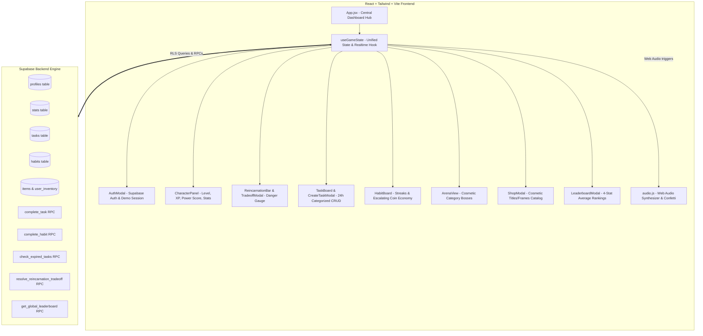

# Life RPG — Implementation Walkthrough & Master Advisories

This document provides a comprehensive technical walkthrough of how the Life RPG web application will be implemented, structured, and verified, preceded by the **Master Advisories** that govern all architectural and game-design decisions.

---

## 🏛️ Master Advisories (Core Directives & System Constraints)

These master advisories derive directly from the specification in [`life-rpg-project-context.md`](./life-rpg-project-context.md) and must be strictly followed throughout implementation:

### 1. Server-Side Authority & Anti-Cheat Rule
> [!IMPORTANT]
> **Never trust client-side arithmetic for rewards or penalties.**
> All XP gains, stat increments, leveling-up loops, streak increments, coin additions, and reincarnation penalties must be calculated and verified via PostgreSQL stored procedures (RPCs) in Supabase. The client may optimistically reflect updates, but the server is the single source of truth.

### 2. The Cosmetic Arena Directive
> [!NOTE]
> **Enemies in the Arena are 100% cosmetic.**
> The bosses (*Chronos of Procrastination*, *The Sloth Behemoth*, *Chaos Chimera*, and *Phantom of Hesitation*) serve visual theme and immersion only. They do **not** deal damage, have HP, block player actions, or alter any leveling/penalty game logic.

### 3. Named Constants & Tunability
> [!TIP]
> **Zero hardcoded magic numbers in application logic.**
> Every game parameter must reference the central [`src/constants/gameConfig.js`](./src/constants/gameConfig.js):
> - $x = 15$ (`RECEIVE_ON_FAIL`) added on task expiration.
> - $y = 8$ (`REDUCE_ON_COMPLETE`) relieved on task completion.
> - Constraint $x > y$ (15 > 8) strictly maintained.
> - `MAX_HABIT_DAILY_COINS = 10` daily streak cap.
> - Reincarnation sacrifices: 25% stats or 50% coins.

### 4. Intentional Stubs Preservation
> [!NOTE]
> **Keep placeholder architectures intact.**
> The habit streak-break penalty and the coin-balance loophole are intentionally deferred design points. The backend RPC `stub_handle_habit_streak_break` and its frontend call points must be maintained cleanly with comments so they can be upgraded without breaking changes.

### 5. Zero-Tolerance Technical Disqualifiers
> [!CAUTION]
> - **No localStorage as primary storage**: All player data must live in Supabase Postgres under Row Level Security.
> - **Zero unhandled console crashes**: Every async call, RPC, and auth flow must be wrapped in error boundaries/toast handlers.
> - **Strict Accessibility**: Zero `
` elements. Every interactive item must be a semantic `<button>`, `<a>`, or `<input>` with visible keyboard focus rings.
> - **Real Commit History**: Meaningful, atomic git commits accompanying each feature phase.

---

## 🗺️ System Architecture & Data Flow

---

## 🛠️ Step-by-Step Implementation Walkthrough

### Step 1: Authentication & Session Management
* **Files**: `src/components/AuthModal.jsx`, `src/lib/supabase.js`
* **What it does**:
  1. Renders a cyberpunk/fantasy themed modal for **Sign In** and **Sign Up**.
  2. Integrates `supabase.auth.signUp()` and `signInWithPassword()`.
  3. Includes a **"Demo Hero"** button: instantly initializes an in-memory or demo profile so developers and judges can evaluate the full game loop without mandatory sign-up hurdles.
  4. Header displays user status with an intuitive **Sign Out** button.

### Step 2: Unified Game State Engine (`useGameState.js`)
* **Files**: `src/hooks/useGameState.js`
* **What it does**:
  1. Single source of state for the entire application:
     - `profile`: `{ current_level, current_xp, coin_balance, reincarnation_meter }`
     - `stats`: `{ intellect, strength, discipline, willpower }`
     - `tasks`: list of active and completed tasks
     - `habits`: list of habits with streak data
     - `inventory`: owned cosmetic titles, frames, and equipped status
  2. Wraps all Supabase RPC calls with **optimistic UI updates**:
     - Clicking "Complete Task" immediately marks it complete and plays the audio chime, rolling back only if the network rejects it.
  3. Provides notification toasts on level up, coin earning, and stat increases.

### Step 3: Top HUD — Character Panel & Reincarnation Danger Bar
* **Files**: `src/components/CharacterPanel.jsx`, `src/components/TradeoffModal.jsx`
* **What it does**:
  1. **Character Card**: Level badge, dynamic XP bar ($\text{XP} / \text{XP required}$), animated coin balance, equipped cosmetic frame and title.
  2. **Stat Radar/Cards**: Visual meters for Intellect, Strength, Discipline, Willpower, plus calculated **Power Score** ($\text{Average of 4 stats}$).
  3. **Reincarnation Pressure Meter**:
     - Global 0–100 gauge glowing amber $\rightarrow$ red.
     - When meter reaches 100, the **Tradeoff Modal** interrupts the screen with an ominous audio alert.
     - Player chooses: **Sacrifice 25% Stats** (drops leaderboard ranking) OR **Sacrifice 50% Coins** (preserves stats). Calls `resolve_reincarnation_tradeoff` and resets the meter to 0.

### Step 4: Categorized Task Board & 24-Hour Rolling Deadlines
* **Files**: `src/components/TaskBoard.jsx`, `src/components/CreateTaskModal.jsx`
* **What it does**:
  1. **Creation**: Title, Category dropdown (Academics, Fitness, Lifestyle, Other), and Difficulty pills (Easy, Medium, Hard).
  2. **Categorized Matrix**: Displays tasks grouped under their respective categories with category badges and rolling countdown timers ($< 24\text{h}$).
  3. **Completion Flow**:
     - Calls `complete_task(task_id)` RPC.
     - Triggers audio chime and floating $+XP$ and $+Stat$ visual indicators.
     - Detects **Category All-Clear**: If all tasks in a category are completed, awards the sum-of-difficulty bonus with a celebration banner!
  4. **Expiry Verification**: Runs a background check calling `check_expired_tasks()` to penalize overdue tasks.

### Step 5: Habit Forge (Streaks & Escalating Coin Economy)
* **Files**: `src/components/HabitBoard.jsx`
* **What it does**:
  1. Lists recurring daily habits with streak flames ($\text{Streak: } N \text{ days}$).
  2. **Daily Check-In Button**:
     - Validates check-in hasn't already occurred today.
     - Invokes `complete_habit(habit_id)` RPC.
     - Awards escalating coins: $\min(\text{streak}, 10)$.
     - Plays the coin chime and golden particle burst.

### Step 6: The Arena (Cosmetic Guardians)
* **Files**: `src/components/ArenaView.jsx`
* **What it does**:
  1. Atmospheric cards for each category boss:
     - 🦉 *Chronos of Procrastination* (Academics)
     - 🦏 *The Sloth Behemoth* (Fitness)
     - 🐍 *Chaos Chimera* (Lifestyle)
     - 👁️ *Phantom of Hesitation* (Other)
  2. Visual indicator showing the player's stat level relative to the boss's menacing aura. (Cosmetic only).

### Step 7: Cosmetics Shop & Inventory
* **Files**: `src/components/ShopModal.jsx`
* **What it does**:
  1. Displays items loaded from the `items` catalog table (Titles like *"Arcane Scholar"*, Frames like *"Ember Aura"*, Badges).
  2. Direct purchase with coins checking balance.
  3. **Inventory tab**: Enables clicking **"Equip"** to immediately update the player's avatar frame and title on the Character Panel.

### Step 8: Global Leaderboard
* **Files**: `src/components/LeaderboardModal.jsx`
* **What it does**:
  1. Renders the top 100 players from `get_global_leaderboard()`.
  2. Displays Rank #, Name/Email prefix, Level, and Average Stat score.
  3. Highlights the logged-in player's position.

### Step 9: Audio, Confetti & Accessibility Polish
* **Files**: `src/lib/audio.js`, `src/App.jsx`
* **What it does**:
  1. Hook synthesized sounds to user interactions (tasks, coins, level up, crisis).
  2. Global Mute/Unmute audio toggle in the top navbar.
  3. `canvas-confetti` fireworks upon level up.
  4. Full `Tab` + `Enter`/`Space` keyboard navigation verification.

---

## 🎬 Zero-Tolerance Hackathon Verification Plan

Before submission, the app will be tested against the mandatory 90–180 second demo script:
1. **Signup / Login**: Create a new account $\rightarrow$ observe Level 1, 0 XP, 0 Coins, 10 in all stats.
2. **Add & Complete Task**: Create an "Academics" hard task $\rightarrow$ complete it $\rightarrow$ observe Intellect stat boost and Reincarnation bar relief.
3. **Habit Streak & Coin Earn**: Check in a habit $\rightarrow$ observe streak increment and coins added.
4. **Level Up Fanfare**: Gain sufficient XP to hit Level 2 $\rightarrow$ observe non-linear formula trigger, level up chime, and confetti.
5. **Page Refresh**: Press $F5$ to reload $\rightarrow$ verify all stats, coins, and completed tasks persist from Postgres.
