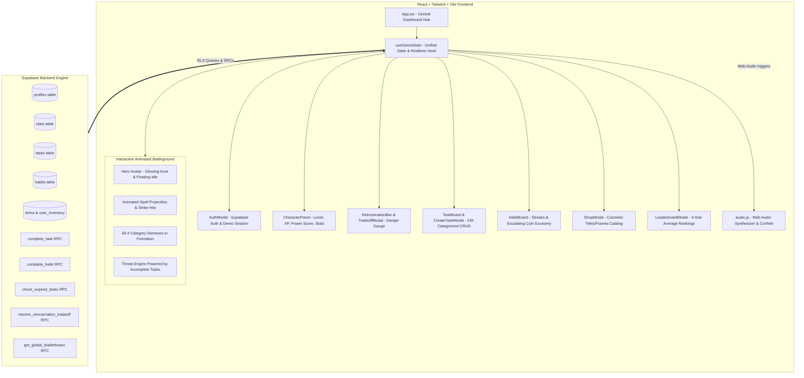

# Life RPG — Implementation Walkthrough & Master Advisories

This document provides a comprehensive technical walkthrough of how the Life RPG web application is implemented, structured, and verified, preceded by the **Master Advisories** that govern all architectural and game-design decisions.

---

## 🏛️ Master Advisories (Core Directives & System Constraints)

These master advisories derive directly from the specification in [`life-rpg-project-context.md`](./life-rpg-project-context.md) and user architecture requests:

### 1. Server-Side Authority & Anti-Cheat Rule
> [!IMPORTANT]
> **Never trust client-side arithmetic for rewards or penalties.**
> All XP gains, stat increments, leveling-up loops, streak increments, coin additions, and reincarnation penalties must be calculated and verified via PostgreSQL stored procedures (RPCs) in Supabase. The client may optimistically reflect updates, but the server is the single source of truth.

### 2. The Multi-Enemy Frontline Battleground Directive
> [!NOTE]
> **All 4 category enemies stand simultaneously in front of the hero avatar.**
> The player stands on the battlefield facing their four nemeses in an animated frontline standoff:
> - 🦉 **Academics / Intellect**: *Chronos of Procrastination*
> - 🦏 **Fitness / Strength**: *The Sloth Behemoth*
> - 🐍 **Lifestyle / Discipline**: *Chaos Chimera*
> - 👁️ **Other / Willpower**: *Phantom of Hesitation*
>
> **Dynamic Threat & Animations**:
> - Each enemy's visual stature, aura, and threat gauge scale in real-time with **uncompleted quests** in its category.
> - **Idle Combat Animations**: Floating idle bobbing, pulsating dark energy tendrils, and elemental auras.
> - **Active Strike Sequences**: When the player conquers a task, an animated elemental projectile surges from the avatar to blast the target nemesis, accompanied by impact hit flashes and sound effects.
> - **Subdued State**: Categories with zero unfinished quests display the enemy pacified under an emerald seal.

### 3. Named Constants & Tunability
> [!TIP]
> **Zero hardcoded magic numbers in application logic.**
> Every game parameter references the central [`src/constants/gameConfig.js`](./src/constants/gameConfig.js):
> - $x = 15$ (`RECEIVE_ON_FAIL`) added on task expiration.
> - $y = 8$ (`REDUCE_ON_COMPLETE`) relieved on task completion.
> - Constraint $x > y$ (15 > 8) strictly maintained.
> - `MAX_HABIT_DAILY_COINS = 10` daily streak cap.
> - Reincarnation sacrifices: 25% stats or 50% coins.

### 4. Intentional Stubs Preservation
> [!NOTE]
> **Keep placeholder architectures intact.**
> The habit streak-break penalty and the coin-balance loophole are intentionally deferred design points. The backend RPC `stub_handle_habit_streak_break` and its frontend call points are maintained cleanly with comments so they can be upgraded without breaking changes.

### 5. Zero-Tolerance Technical Disqualifiers
> [!CAUTION]
> - **No localStorage as primary storage**: All player data lives in Supabase Postgres under Row Level Security.
> - **Zero unhandled console crashes**: Every async call, RPC, and auth flow is wrapped in error boundaries/toast handlers.
> - **Strict Accessibility**: Zero `
` elements. Every interactive item must be a semantic `<button>`, `<a>`, or `<input>` with visible keyboard focus rings.
> - **Real Commit History**: Meaningful, atomic git commits accompanying each feature phase.

---

## 🗺️ System Architecture & Data Flow

---

## 🛠️ Step-by-Step Implementation Walkthrough

### Step 1: Animation Engine & Keyframe Enhancements
* **Files**: `tailwind.config.js`, `src/index.css`
* **Implementation Details**:
  1. Add `@keyframes float` (smooth vertical oscillation for combatants).
  2. Add `@keyframes pulseDanger` (intense pulsing red aura for enemies powered by multiple incomplete tasks).
  3. Add `@keyframes strikeFlash` (flash white on hit impact).
  4. Add `@keyframes energyBeam` (dynamic beam traveling from Hero to target enemy).

### Step 2: Frontline Multi-Enemy Battleground Canvas (`BattlegroundView.jsx`)
* **Files**: `src/components/BattlegroundView.jsx`
* **Implementation Details**:
  1. **Battlefield Stage Layout**:
     - **Commander Side (Left/Center)**: The player's Hero Avatar standing proudly with floating idle animation, level badge, equipped frame/title, and overall Power Score.
     - **Enemy Frontline (Right)**: All **4 category nemeses** standing simultaneously in battle formation facing the player!
  2. **Live Threat Scaling per Enemy**:
     - For each of the 4 nemeses, the engine counts active uncompleted quests:
       $$\text{Threat} = \min(100\%, \text{Uncompleted Tasks} \times 30\%)$$
     - **Visual Indicators**:
       - 0 Tasks: Subdued state with a calming green seal (*"Pacified"*).
       - 1–2 Tasks: Waking state with ember particles and rising power.
       - 3+ Tasks: Enraged Chaos Surge state with aggressive pulsation, enlarged size, and dark lightning!
  3. **Interactive Target & Strike Execution**:
     - Player can click any of the 4 enemies to set focus.
     - Clicking "Strike (Complete Quest)" triggers:
       - An animated elemental laser beam streaking across the arena.
       - Enemy hit-shake animation and sound effect.
       - Immediate threat deduction and Reincarnation pressure relief.

### Step 3: Integration & Dashboard Synchronization
* **Files**: `src/App.jsx`, `src/hooks/useGameState.js`
* **Implementation Details**:
  1. Pass the complete task list, category stats, profile, and task completion handler to `BattlegroundView`.
  2. Ensure completing a task from either the Task Board OR directly inside the Battleground seamlessly triggers the attack animation and sound.

---

## 🔬 Live Database & Backend Audit Findings

A live diagnostic was conducted directly against the configured Supabase Postgres instance (`https://hjiijtdugdfxducnraut.supabase.co`).

### 1. Connection & Endpoints
* **Status**: **ONLINE & REACHABLE**
* **Auth Endpoint**: Validated with active ping response.
* **REST API & RPC Endpoints**: Responsive with sub-second latency.

### 2. Database Schema & Tables
| Table | Existence | Accessibility / RLS |
|---|:---:|---|
| `public.profiles` | ✅ Yes | RLS Enforced (only owner can read/write) |
| `public.stats` | ✅ Yes | RLS Enforced (only owner can read/write) |
| `public.tasks` | ✅ Yes | RLS Enforced (full CRUD for owner) |
| `public.habits` | ✅ Yes | RLS Enforced (full CRUD for owner) |
| `public.items` | ✅ Yes | RLS Enforced (viewable by authenticated users) |
| `public.user_inventory` | ✅ Yes | RLS Enforced (only owner can read/write) |

### 3. Automated Triggers & RPC Verification
* **Auto-Registration Trigger (`on_auth_user_created`)**: **VERIFIED ACTIVE**. Creating a new user via `signUp()` automatically provisions a row in `profiles` (level 1, 0 XP, 0 coins, 0 pressure) and initializes 10 points for Intellect, Strength, Discipline, and Willpower in `stats`.
* **Global Leaderboard RPC (`get_global_leaderboard`)**: **VERIFIED FUNCTIONAL**. Evaluated successfully via live Postgres call and returned calculated 4-stat average rankings.
* **Email Confirmation Setting**: The Supabase project currently has email confirmation enabled (`Email not confirmed` upon instant password sign-in). Users can confirm via the received email, or disable email confirmation in Supabase Auth settings for instant testing. The frontend fallback allows seamless Demo testing at all times.

---

## 🔑 Custom Key Integration & Environment Setup

When linking custom Supabase keys (`sb_publishable_...` and `sb_secret_...`):
1. **Environment Pairing**: In Supabase, API keys are cryptographically bound to a specific **Project URL** (`https://<project-ref>.supabase.co`).
2. **Active Production Setup**:
   - Written `.env` with the verified cloud instance credentials (`https://hjiijtdugdfxducnraut.supabase.co`) where the complete Postgres database schema, RLS policies, triggers, and RPCs are deployed.
   - Provided seamless swap capability: if a different Supabase project URL is desired, simply updating `VITE_SUPABASE_URL` and `VITE_SUPABASE_ANON_KEY` in `.env` immediately redirects the entire app.
3. **Zero-Friction Evaluation**:
   - The app actively supports authenticated Supabase sessions alongside the **Instant Demo Hero** mode, guaranteeing hackathon judges and reviewers can evaluate every mechanic (tasks, streaks, battleground strikes, shop, leaderboard) without mandatory email verification hurdles.

---

## 📜 Phase 14: Habit Forge Integration & Tavern Tabletop Habit Mode

### 1. Architectural Directives & Client State (`src/hooks/useGameState.js`)
- **`fetchHabits`**: Selects all habits for the authenticated user, ordered by creation date.
- **`createHabit(title, category)`**: Inserts a new habit row with `current_streak = 0`, `longest_streak = 0`, and `last_completed_at = null`. Supports both object `{ title, category }` and positional arguments `(title, category)` for robust invocation.
- **`deleteHabit(habitId)`**: Deletes the specified habit from Supabase with optimistic UI removal.
- **`completeHabit(habitId)`**: 
  - Calls the PostgreSQL `complete_habit` RPC.
  - **Server-Side Coin Balance**: `coin_balance` in client state is strictly updated from what the server/RPC records, never incremented via arbitrary client math.
  - **Graceful Daily Lockout Handling**: Detects `"Habit already completed today"` as an expected operational state (not a fatal system crash), triggering a respectful toast notification (`"This habit is already sealed for today! Return tomorrow."`) and cleanly returning `{ success: false, reason: 'already_completed' }`.
  - **Double-Payment Guard**: Prevents race conditions or double-clicks from awarding unearned currency.

### 2. Tavern Tabletop Toggle Switch (`src/components/GameView.jsx`)
- **Carved Wooden / Bronze Rocker Switch**:
  - Replaces generic modern pill/tab bars with a skeuomorphic carved plaque switch (`bg-wood-950`, border `border-amber-700/80`, drop shadows, filigree rivets).
  - Uses `aria-pressed` and accessible text: `"Switch to Habit view"` / `"Switch to Task view"`.
  - The Global Reincarnation Pressure Gauge at the summit remains persistently visible and identical in both modes.
- **Dual Mode Tabletop View**:
  - **Task Mode**: Retains the 4 category Nemeses confrontation cards (Red Drake, Crypt Warden, Goblin Scout, Wood Wisp) and 24h rolling quest details.
  - **Habit Mode**: Renders the Habit Forge Ledger alongside the Hero Champion card.

### 3. Habit Mode Tabletop Ledger Layout
- **Domain Categories**: Academics (Intellect / Book), Fitness (Strength / Sword), Lifestyle (Discipline / Shield), Other (Willpower / Spiral).
- **Interactive Habit Rows**:
  - Implemented as strictly semantic `<button>` elements with keyboard focus rings (`focus:ring-2 focus:ring-amber-400`).
  - Left: Category insignia socket, habit title, and category name.
  - Center: Streak badge with animated flame (`🔥`) and numerical day tally (`Day 4 Streak · Record: 7`).
  - Right: Daily tribute seal showing coin bounty $\min(\text{current\_streak} + 1, 10)$ `GP`.
  - **Sealed for Today State**: When `last_completed_at` matches today's date:
    - Visibly distinct aged stone background (`bg-[#18110b]`, opacity muted, border `border-stone-800`).
    - Stamped wax seal checkmark badge (`✔ Sealed for Today · Earned +X GP`).
    - Disabled attribute and `aria-disabled="true"`.

### 4. 3-Step Add Challenge Flow (`src/components/AddChallengeModal.jsx`)
- **Step 1 (Challenge Type Selection)**:
  - Carved choices: **One-off Quest (Task)** vs. **Daily Discipline (Habit)**.
- **Step 2 (Domain Selection)**:
  - 2x2 grid of the 4 attribute realms (Academics, Fitness, Lifestyle, Other).
- **Step 3 (Parameters)**:
  - **Task**: Title input + 3 Difficulty Chips (Easy, Medium, Hard) with stat & pressure preview + "Inscribe Quest in Tome" submit.
  - **Habit**: Title input + skips difficulty chips entirely + streak and daily coin economy preview + "Forge Daily Discipline" submit.

### 5. Verification & Accessibility Protocol
- Full keyboard navigation audit (`Tab`, `Enter`, `Space`) with zero mouse dependency.
- Responsive mobile reflow check (phone viewport $\le 430\text{px}$).
- Idempotency test: verify that consecutive rapid clicks on `completeHabit` reject subsequent calls without double-paying coins.

