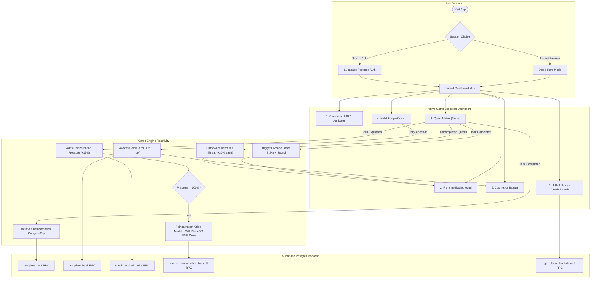

# Life RPG — Complete Website Workflow & Architecture Guide

This document explains the end-to-end technical and gameplay workflow of the **Life RPG** web application, detailing how components interact, how user actions propagate to the database, and how game systems maintain immersion and balance.

---

## 🧭 Master Workflow Diagram

---

## 🕹️ Subsystem-by-Subsystem Gameplay Workflow

### 1. Onboarding & Session Management
* **Component**: [`src/components/AuthModal.jsx`](./src/components/AuthModal.jsx) & [`src/hooks/useGameState.js`](./src/hooks/useGameState.js)
* **How it Works**:
  1. When a user visits the app, the system checks for an existing Supabase session via `supabase.auth.getSession()`.
  2. If authenticated, the user's profile, stats, tasks, habits, and inventory are hydrated directly from Supabase Postgres.
  3. If not authenticated, the app launches in **Demo Hero Mode**, allowing full interactivity with zero blank-screen crashes.
  4. Clicking **"Login"** opens the modal:
     - **Sign In / Sign Up**: Email/password authentication via Supabase Auth.
     - **Instant Demo Access**: 1-click bypass for instant evaluations and hackathon judges.

---

### 2. Character HUD & Progression Engine
* **Component**: [`src/components/CharacterPanel.jsx`](./src/components/CharacterPanel.jsx)
* **How it Works**:
  1. **Level Progress**: Non-linear leveling formula enforced by the engine:
     $$\text{XP Required} = 100 \times (\text{Current Level}^{1.5})$$
  2. **Attributes**: Tracks the 4 primary attributes:
     - **Intellect** $\leftarrow$ Academics
     - **Strength** $\leftarrow$ Fitness
     - **Discipline** $\leftarrow$ Lifestyle
     - **Willpower** $\leftarrow$ Other
  3. **Overall Power Score**: Calculated as the exact average of the 4 attributes:
     $$\text{Power Score} = \frac{\text{Intellect} + \text{Strength} + \text{Discipline} + \text{Willpower}}{4}$$
  4. **Coin Pouch**: Displays gold coins collected **exclusively from habits**.

---

### 3. The Frontline Battleground (Hero vs 4 Nemeses)
* **Component**: [`src/components/BattlegroundView.jsx`](./src/components/BattlegroundView.jsx)
* **How it Works**:
  1. **Standoff Formation**: The player's Hero Avatar stands on the left with an idle floating animation (`animate-float`), equipped title, and avatar frame.
  2. **The 4 Nemeses**: All four category enemies stand simultaneously in front of the hero:
     - 🦉 *Chronos of Procrastination* (Academics)
     - 🦏 *The Sloth Behemoth* (Fitness)
     - 🐍 *Chaos Chimera* (Lifestyle)
     - 👁️ *Phantom of Hesitation* (Other)
  3. **Dynamic Threat Mechanic ("Powered by Incomplete Tasks")**:
     - The engine counts unfinished quests in each category.
     - Each unfinished quest increases that enemy's **Chaos Threat Gauge** by $+30\%$.
     - When threat reaches $\ge 60\%$, the enemy enters **Chaos Rage** (`animate-pulse-danger`), enlarging in size and crackling with dark fire (`🔥`).
  4. **Animated Combat Sequence**:
     - Clicking **"Strike (Complete)"** directly from the Battleground fires an arcane laser beam across the arena.
     - The target nemesis reels in a hit-shake impact animation (`animate-hit-shake`).
     - When all quests in a category are completed, the nemesis is sealed under an emerald peace seal (*"Realm Pacified"*).

---

### 4. Quest Matrix (One-Off Tasks)
* **Components**: [`src/components/TaskBoard.jsx`](./src/components/TaskBoard.jsx), [`src/components/CreateTaskModal.jsx`](./src/components/CreateTaskModal.jsx)
* **How it Works**:
  1. **Inscription**: User adds a task with a **Title**, **Category** (immutable after creation), and **Difficulty**:
     - **Easy**: $+15$ XP, $+3$ Stat, $-2$ Stat penalty on expiry.
     - **Medium**: $+27$ XP, $+6$ Stat, $-4$ Stat penalty on expiry.
     - **Hard**: $+45$ XP, $+10$ Stat, $-7$ Stat penalty on expiry.
  2. **24-Hour Rolling Deadline**: Each task has an independent countdown timer.
  3. **Category All-Clear Bonus**:
     - When the final active task in a category is completed, the engine detects that zero active quests remain.
     - Awards a bonus scaled by the difficulty sum, triggers a golden confetti burst, and announces realm liberation!
  4. **Reincarnation Relief**: Every completed task relieves the Reincarnation Pressure Gauge by $y = 8\%$.

---

### 5. Habit Forge (Streaks & Economy)
* **Component**: [`src/components/HabitBoard.jsx`](./src/components/HabitBoard.jsx)
* **How it Works**:
  1. **The Sole Source of Currency**: Habits are the **only way** to earn gold coins in the entire game.
  2. **Escalating Coin Multiplier**:
     $$\text{Coins Awarded} = \min(\text{Current Streak}, 10)$$
     - Day 1: 1 Coin | Day 2: 2 Coins | Day 3: 3 Coins ... capped at 10 Coins/day.
  3. **Daily Anti-Duplicate Check**:
     - The button locks to *"Fortified Today"* after checking in, preventing multiple claims on the same calendar day.
  4. **Longest Streak Record**: Automatically tracks and preserves personal bests.

---

### 6. Global Reincarnation Danger Gauge & Crisis Dilemma
* **Components**: [`src/components/CharacterPanel.jsx`](./src/components/CharacterPanel.jsx), [`src/components/TradeoffModal.jsx`](./src/components/TradeoffModal.jsx)
* **How it Works**:
  1. **The $x > y$ Dynamic**:
     - Completing a task relieves the meter by $y = 8\%$.
     - Failing/expiring a task increases the meter by $x = 15\%$.
     - Because $x > y$, sustained neglect compounds faster than good behavior can undo it.
  2. **The 100% Crisis Interruption**:
     - When the meter reaches $100\%$, an ominous alarm sounds and the **Tradeoff Modal** locks the screen.
     - The player must choose one of two sacrifices:
       - **Sacrifice 25% Stats**: Surrenders attributes; coins preserved, but leaderboard standing drops.
       - **Sacrifice 50% Coins**: Surrenders gold pouch; attributes and leaderboard standing preserved.
     - Resolving the crisis resets the meter back to $0\%$.

---

### 7. Cosmetics Bazaar (Shop & Inventory)
* **Component**: [`src/components/ShopModal.jsx`](./src/components/ShopModal.jsx)
* **How it Works**:
  1. **Items Catalog**: Displays cosmetic Titles (*Novice Adventurer*, *Arcane Scholar*, *Iron Titan*) and Avatar Frames (*Ember Aura*, *Astral Void*).
  2. **Coin Purchase**: Deducts gold coins from the player's pouch and adds the item to `user_inventory`.
  3. **Equip System**:
     - Players can equip titles or frames from the **Hero Inventory** tab.
     - Equipping an item immediately alters the player's avatar in the Character Panel and Frontline Battleground.
  4. **Strict Cosmetic Separation**: Coins and items have **zero influence on the leaderboard**.

---

### 8. Hall of Heroes (Global Leaderboard)
* **Component**: [`src/components/LeaderboardModal.jsx`](./src/components/LeaderboardModal.jsx)
* **How it Works**:
  1. Queries the Postgres RPC `get_global_leaderboard()`.
  2. **Ranking Formula**:
     $$\text{Rank Score} = \frac{\text{Intellect} + \text{Strength} + \text{Discipline} + \text{Willpower}}{4}$$
  3. Displays rank badges (Crown for #1, Medals for #2 and #3) and highlights the active player's row.

---

### 9. Audio & Sensory Feedback
* **Libraries**: [`src/lib/audio.js`](./src/lib/audio.js), `canvas-confetti`
* **How it Works**:
  - **Synthesized Sound Effects**: Built with native Web Audio API (zero external MP3 dependencies).
    - `playTaskComplete()`: 3-note ascending chime (C5 $\rightarrow$ E5 $\rightarrow$ G5).
    - `playCoin()`: Double high-pitch chime (B5 $\rightarrow$ E6).
    - `playLevelUp()`: 4-chord heroic fanfare.
    - `playTradeoffAlert()`: Ominous sawtooth warning.
  - **Header Mute Toggle**: Global speaker button in the top navbar persists audio preferences.
  - **Confetti Bursts**: Triggered on Level Up and Category All-Clear events.

---

## 🔒 Security & Data Integrity

1. **Row Level Security (RLS)**:
   - Every Postgres table (`profiles`, `stats`, `tasks`, `habits`, `user_inventory`) enforces `auth.uid() = user_id`.
   - Users cannot view, modify, or delete tasks belonging to other accounts.
2. **Server-Side Anti-Cheat**:
   - Math calculations (XP loops, level increments, streak escalation, trade-off deductions) execute inside PostgreSQL RPCs (`complete_task`, `complete_habit`, `resolve_reincarnation_tradeoff`).
   - The frontend never dictates arbitrary stat gains.
